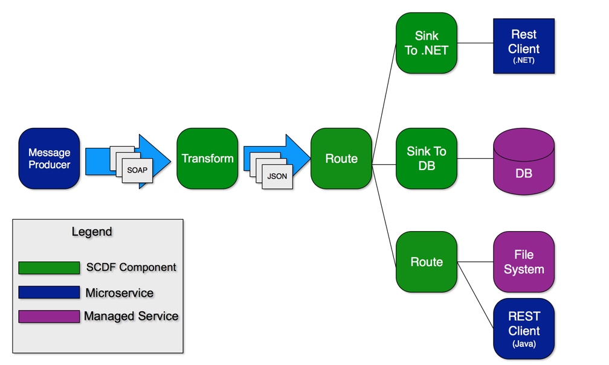
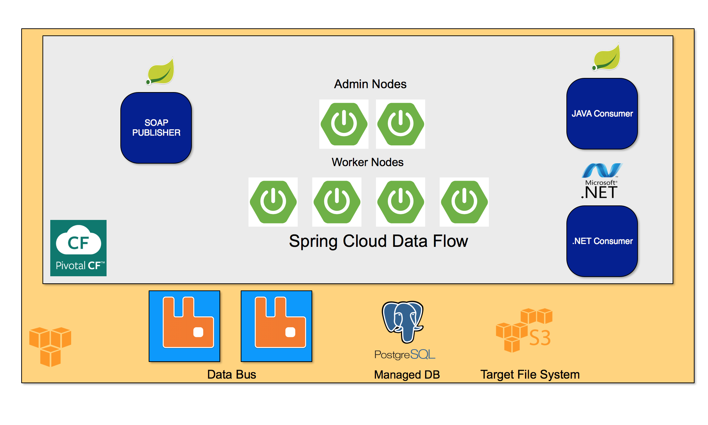

# Message Stream Processing

## Overview

This demo shows how to process, enrich and route messages to different sinks.



This demo is built on PWS (Pivotal Web Services). This is a Pivotal managed installation of Pivotal Cloud Foundry on AWS.

The components involved, and where they are deployed within the Cloud are as follows.



## Set Up

### Spring Cloud Data Flow Server

To set up the Spring Cloud Data Flow (SCDF) Server, I modified the scripts found in this project:

https://github.com/lshannon/spring-cloud-data-flow-setup

Similar scripts can be found in the 'scripts' folder of this project.

To run this you will need a paid subscription on PWS and a CloudAMQP plan that is at least as robust as 'Tiger'.

### Message Production

Our messages will be SOAP messages being published on to Rabbit MQ queue. They will come as a steady stream. To get this result we took the following code base and made a few tweaks for it to write its SOAP Objects into a RabbitMQ exchange:

https://spring.io/guides/gs/producing-web-service/

#### Setting Up RabbitMQ Locally (Only if you wish to build the message-producer)

To build the message-producer locally you will need a RabbitMQ running locally, otherwise the Test will not pass as the RabbitTemplate will not be able to create a ConnectionFacactory. With a Mac installing Rabbit can be done using Brew:

```shell

brew install rabbitmq

...

brew services start rabbitmq

```
After the installation, admin console can be found here:

http://127.0.0.1:15672/

(guest/guest)

The message-producer application is configured to create the Exchanges and Queues it needs upon start up. A Fan Out exchange called 'messages' will be created, a Queue also called 'messages' (lazy with the naming) is created. The Exchange is bound to the Queue. These details can be found in the MessageQueueConfig class of the message-producer.

#### Setting Up RabbitMQ on PWS

Simply create a free instance of the CloudAMQP broker from the Marketplace:

```shell

cf create-service cloudamqp tiger scdf-rabbitmq-queue

```
Similar to local, once the application is connected it will create the necessary queues and exchanges.

We will use this for both the data bus of SCDF and our queue for our SOAP messages.

Lets test by creating a stream that writes the messages in the RabbitMQ 'messages' queue to the log.

```shell

dataflow config server https://message-routingdevelopment-dataflow-server.cfapps.io
app import http://bit.ly/Bacon-RELEASE-stream-applications-rabbit-maven
stream create luke1 --definition "rabbit --queues=messages | log" --deploy

```
A note routes need be less than 63 characters. Ensure not to put larger Stream names as SCDF will add to them.

## Transforming From SOAP to JSON

To do this we will need to:

1. Create a Processor class with a Stream Listener to specifiy the input and output
2. Install this application into the local maven repository (a remote one can be used as well)
3. Register the component with the SCDF Data Server running on PWS

The Input is going to be the Rabbit MQ our message production application is posting messages too.

The Output is a different Rabbit MQ. Specifically the one the SCDF streams are using as a backing data bus. Kafka can also be used here, however PWS does not have a Kafka service. So Rabbit it is.

A note on Queues in Spring Cloud Data Flow. If you are using multiple brokers (ie: Rabbit MQ and Kafka or two Rabbit MQ), there is a bit of extra configuration.

https://docs.spring.io/spring-cloud-dataflow/docs/current/reference/htmlsingle/#spring-cloud-dataflow-stream-multi-binder

To make our lives simpler we will be using the same RabbitMQ instance for our message-producer to write too as well as SCDF to use as a backing message bus.

### Installing The Transformer

The transformer code is located in the 'simple-message-processor' project. This custom component performs:

1. Transform message to JSON
2. Adding routing key to JSON

This can be found in the Process component.

```java

  @PostConstruct
	private void init() {
		routingKeys = new ArrayList<String>();
		routingKeys.add("java");
		routingKeys.add(".net");
		routingKeys.add("log");
		routingKeys.add("db");
		routingKeys.add("file");
		mapper = new ObjectMapper();
	}

	@StreamListener(Processor.INPUT)
	@Output(Processor.OUTPUT)
	public String process(String message) {
		ProcessedMessage messageObj = new ProcessedMessage(message, getRoutingKey());
		String json = null;
		log.debug("Got a message to process: " + message);
		try {
			json = mapper.writeValueAsString(messageObj);
		} catch (JsonProcessingException e) {
			log.error("Unable to convert: " + messageObj.toString() + " to JSON");
		}
		log.debug("Processing Complete. Resulting JSON: " + json);
		return json;
	}

	private String getRoutingKey() {
		int rnd = new Random().nextInt(routingKeys.size());
		return routingKeys.get(rnd);
	}


```

This application is built and packaged using maven. Part of the build process is to copy this artifact to the 'processor-repository' static folder.

From inside the folder run:

```shell

./mvnw clean package

```

You will see the following line where the copy is happening.

```shell

[copy] Copying 1 file to /Users/lshannon/Documents/message-stream-processing/processor-repository/src/main/resources/static

```
To compile the 'processor-repository' run the maven clean package in the 'processor-repository'.

```shell

./mvnw clean package

```
While in this folder, log into PCF and then run a cf push.

Once the 'processor-repository' is running in PWS, hit the root page of the application to get the links for the processor and groovy routing rules (routing explained below).

For a more robust solution for managing custom modules, Spring Cloud Skipper should be considered:

https://github.com/spring-cloud/spring-cloud-skipper

Once the 'processor-repository' is running in PWS, the custom component can be registered in the SCDF shell with the following command.

```shell

dataflow:>app register --name simple-message-processor --type processor --uri https://<application name>.cfapps.io/simple-message-processor.jar
Successfully registered application 'processor:simple-message-processor'

```
Should you wish to remove it, in the SCDF shell run the following:

```shell

app unregister --name simple-message-processor --type processor

```

For more on registering components:
https://docs.spring.io/spring-cloud-dataflow/docs/1.2.1.RELEASE/reference/html/spring-cloud-dataflow-register-apps.html

### Consuming The Message Into The Custom Processor

To test the custom processor, create a stream that routes the messages from the 'simple-message-producer' through the processor and into the logs.

```shell

stream create processor-test --definition "rabbit --queues=messages | simple-message-processor | log" --deploy

```
If this successfully works the logs will contain the following:

```shell

2017-11-13T18:20:55.76-0500 [APP/PROC/WEB/0] OUT 2017-11-13 23:20:55.762  INFO 13 --- [ocessor.luke1-1] opment-dataflow-server-VQZn5fj-luke1-log : {"message":"Do or do not, there is not try","routingKey":".net"}
   2017-11-13T18:20:55.76-0500 [APP/PROC/WEB/0] OUT 2017-11-13 23:20:55.763  INFO 13 --- [ocessor.luke1-1] opment-dataflow-server-VQZn5fj-luke1-log : {"message":"This is Sparta!","routingKey":"java"}
   2017-11-13T18:20:55.76-0500 [APP/PROC/WEB/0] OUT 2017-11-13 23:20:55.764  INFO 13 --- [ocessor.luke1-1] opment-dataflow-server-VQZn5fj-luke1-log : {"message":"Could you pass the salt?","routingKey":"db"}
   2017-11-13T18:20:55.76-0500 [APP/PROC/WEB/0] OUT 2017-11-13 23:20:55.765  INFO 13 --- [ocessor.luke1-1] opment-dataflow-server-VQZn5fj-luke1-log : {"message":"I'm pickle Rick!","routingKey":"file"}
   2017-11-13T18:20:55.76-0500 [APP/PROC/WEB/0] OUT 2017-11-13 23:20:55.768  INFO 13 --- [ocessor.luke1-1] opment-dataflow-server-VQZn5fj-luke1-log : {"message":"By the power of Grey Skull!","routingKey":".net"}
   2017-11-13T18:20:55.77-0500 [APP/PROC/WEB/0] OUT 2017-11-13 23:20:55.769  INFO 13 --- [ocessor.luke1-1] opment-dataflow-server-VQZn5fj-luke1-log : {"message":"Do or do not, there is not try","routingKey":"log"}
   2017-11-13T18:20:55.77-0500 [APP/PROC/WEB/0] OUT 2017-11-13 23:20:55.770  INFO 13 --- [ocessor.luke1-1] opment-dataflow-server-VQZn5fj-luke1-log : {"message":"This is Sparta!","routingKey":"db"}
   2017-11-13T18:20:55.77-0500 [APP/PROC/WEB/0] OUT 2017-11-13 23:20:55.773  INFO 13 --- [ocessor.luke1-1] opment-dataflow-server-VQZn5fj-luke1-log : {"message":"By the power of Grey Skull!","routingKey":".net"}
   2017-11-13T18:20:55.77-0500 [APP/PROC/WEB/0] OUT 2017-11-13 23:20:55.774  INFO 13 --- [ocessor.luke1-1] opment-dataflow-server-VQZn5fj-luke1-log : {"message":"Shop smart, shop S-mart","routingKey":"db"}
   2017-11-13T18:20:55.77-0500 [APP/PROC/WEB/0] OUT 2017-11-13 23:20:55.775  INFO 13 --- [ocessor.luke1-1] opment-dataflow-server-VQZn5fj-luke1-log : {"message":"Do or do not, there is not try","routingKey":"file"}
   2017-11-13T18:20:55.77-0500 [APP/PROC/WEB/0] OUT 2017-11-13 23:20:55.777  INFO 13 --- [ocessor.luke1-1] opment-dataflow-server-VQZn5fj-luke1-log : {"message":"I'm pickle Rick!","routingKey":"java"}
   2017-11-13T18:20:55.77-0500 [APP/PROC/WEB/0] OUT 2017-11-13 23:


```

## Consuming the Routed Streams

Lets start routing these messages. To do this we will set up the consumers first, in doing so we will set up the Rabbit MQ exchanges and queues to handle the messages we route.

This is done in SCDF using named destinations:

https://docs.spring.io/spring-cloud-dataflow/docs/1.2.3.RELEASE/reference/htmlsingle/#spring-cloud-dataflow-stream-dsl-named-destinations

For each routingKey that our transformer will add, we will create a named destination. This will generate a Queue and Exchange.

These are created by running the following commands in the SCDF shell:

```shell

stream create java --definition "rabbit --queues=java | log" --deploy

stream create .net --definition "rabbit --queues=net | log" --deploy

stream create log --definition "rabbit --queues=log | log" --deploy

stream create db --definition "rabbit --queues=db | log" --deploy

stream create file -definition "rabbit --queues=file | log" --deploy

```


## Routing Messages

Next we will route each of the messages to its own rabbit queue.

Do do this we will use the rabbit sink of Spring Cloud Data Flow and the 'routingKey' field we added to the message with the 'simple-message-processor'.

```shell

stream create lws1 --definition "r1: rabbit --queues=messages | simple-message-processor | r2: rabbit --routing-key-expression=#jsonPath(payload,'$.routingKey') --exchange-expression=#jsonPath(payload,'$.routingKey')" --deploy

````
The result of this stream will be to create a queue in Rabbit for each unique 'routingKey' and then send the messages to the queue.


```


