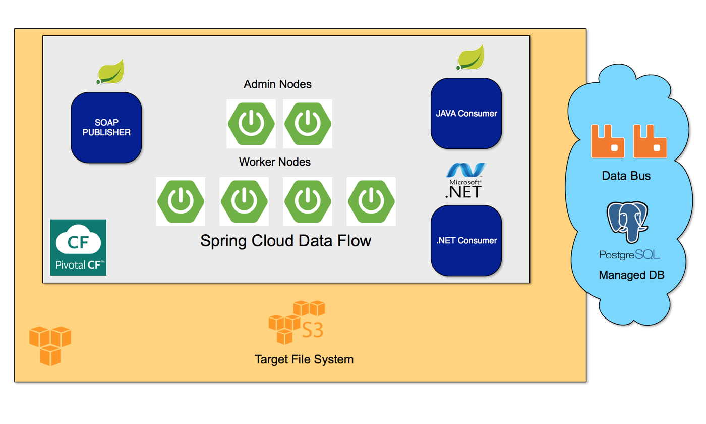

# Message Stream Processing

## Overview

This demo shows how to process, enrich and route messages to different sinks.


This demo is built on PWS (Pivotal Web Services). This is a Pivotal managed installation of Pivotal Cloud Foundry on AWS.

The components involved, and where they are deployed within the Cloud are as follows.



## Set Up

### Spring Cloud Data Flow Server
To set up the Spring Cloud Data Flow (SCDF) Server, please follow the steps in this repo:
https://github.com/lshannon/spring-cloud-data-flow-setup

We will use the Server to create and manage streams.

### Message Production

Our messages will be SOAP messages being published on to Rabbit MQ queue. They will come as a steady stream. To get this result we took the following code base and made a few tweaks for it to write its SOAP Objects into a RabbitMQ exchange:
https://spring.io/guides/gs/producing-web-service/

#### Setting Up RabbitMQ Locally

To build this code locally you will need a RabbitMQ running locally. With a Mac this can be done using Brew:

```shell

brew install rabbitmq
...
brew services start rabbitmq

```
The admin console can be found here:
http://127.0.0.1:15672/
(guest/guest)

To get this to work locally there need to be a fan out exchange called 'messages' that is bound to a Queue (can call it anything you want).

#### Setting Up RabbitMQ on PWS

Simply create a free instance of the CloudAMQP broker:

```shell

cf create-service cloudamqp lemur messages

```


## Transforming From SOAP to JSON

### Installing The Transformer

The soap-to-json-transformer will be published to a local repository. This allows us to connect from the local machine to remote Spring Cloud Data Flow Server to register the custom component.

```shell

app register --name xml-json-enricher --type processor --uri maven://com.lukeshannon.datastreaming:soap-to-json-processor:0.0.1.jar

```
## Routing Messages

## Configuring Routing Behavior


