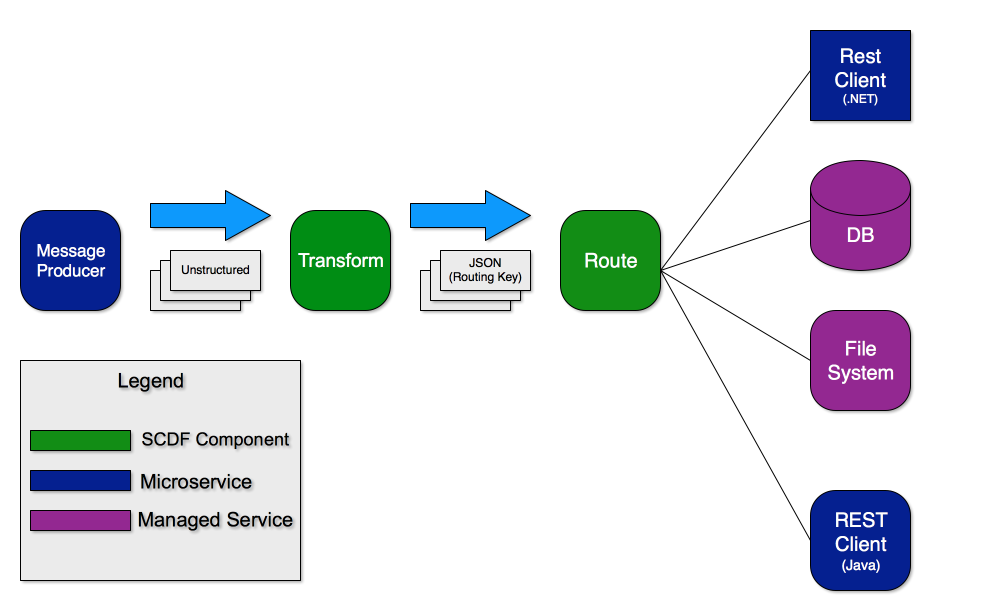

# Message Stream Processing

## Overview

This demo shows how to process, enrich and route messages to different sinks.



This demo is built on PWS (Pivotal Web Services). This is a Pivotal managed installation of Pivotal Cloud Foundry on AWS.

The components involved, and where they are deployed within the Cloud are as follows.


## Set Up

### Spring Cloud Data Flow Server

To set up the Spring Cloud Data Flow (SCDF) Server, I modified the scripts found in this project:

https://github.com/lshannon/spring-cloud-data-flow-setup

Similar scripts can be found in the 'scripts' folder of this project.

To run this you will need a paid subscription on PWS and a CloudAMQP plan that is at least as robust as 'Tiger'.

### Message Production

Our messages will be SOAP messages being published on to Rabbit MQ queue. They will come as a steady stream. To get this result we took the following code base and made a few tweaks for it to write its SOAP Objects into a RabbitMQ exchange:

https://spring.io/guides/gs/producing-web-service/

#### Setting Up RabbitMQ Locally (Only if you wish to build the message-producer)

To build the message-producer locally you will need a RabbitMQ running locally, otherwise the Test will not pass as the RabbitTemplate will not be able to create a ConnectionFacactory. With a Mac installing Rabbit can be done using Brew:

```shell

brew install rabbitmq

...

brew services start rabbitmq

```
After the installation, admin console can be found here:

http://127.0.0.1:15672/

(guest/guest)

The message-producer application is configured to create the Exchanges and Queues it needs upon start up. A Fan Out exchange called 'messages' will be created, a Queue also called 'messages' (lazy with the naming) is created. The Exchange is bound to the Queue. These details can be found in the MessageQueueConfig class of the message-producer.

#### Setting Up RabbitMQ on PWS

Simply create a free instance of the CloudAMQP broker from the Marketplace:

```shell

cf create-service cloudamqp tiger scdf-rabbitmq-queue

```
Similar to local, once the application is connected it will create the necessary queues and exchanges.

We will use this for both the data bus of SCDF and our queue for our SOAP messages.

Lets test by creating a stream that writes the messages in the RabbitMQ 'messages' queue to the log.

```shell

dataflow config server https://message-routingdevelopment-dataflow-server.cfapps.io
app import http://bit.ly/Bacon-RELEASE-stream-applications-rabbit-maven
stream create rabbittest --definition "rabbit --queues=messages | log" --deploy

```

## Transforming From SOAP to JSON

To do this we will need to:

1. Create a Processor class with a Stream Listener to specifiy the input and output
2. Install this application into the local maven repository (a remote one can be used as well)
3. Register the component with the SCDF Data Server running on PWS

The Input is going to be the Rabbit MQ our message production application is posting messages too.

The Output is a different Rabbit MQ. Specifically the one the SCDF streams are using as a backing data bus. Kafka can also be used here, however PWS does not have a Kafka service. So Rabbit it is.

A note on Queues in Spring Cloud Data Flow. If you are using multiple brokers (ie: Rabbit MQ and Kafka or two Rabbit MQ), there is a bit of extra configuration.

https://docs.spring.io/spring-cloud-dataflow/docs/current/reference/htmlsingle/#spring-cloud-dataflow-stream-multi-binder

To make our lives simpler we will be using the same RabbitMQ instance for our message-producer to write too as well as SCDF to use as a backing message bus.

### Installing The Transformer

For convience the 'simple-message-processor' has been packaged in a Spring Boot application. Deploying this application into PWS will give a convient place load the processor from.

For a more robust solution for managing such modules, Spring Cloud Skipper should be considered:

https://github.com/spring-cloud/spring-cloud-skipper

Once the 'processor-repository' application has been deployed the link to get the binary from can be found on the root page of the application. Using this uri, the component can be registered using the SCDF shell like this:

```shell

dataflow:>app register --name simple-message-processor --type processor --uri https://<application name>.cfapps.io/simple-message-processor.jar
Successfully registered application 'processor:simple-message-processor'

```
Should you wish to remove it:

```shell

app unregister --name simple-message-processor --type processor

```

For more on registering components:
https://docs.spring.io/spring-cloud-dataflow/docs/1.2.1.RELEASE/reference/html/spring-cloud-dataflow-register-apps.html

### Consuming The Message Into The Custom Processor

To get the messages being produced to the RabbitMQ Queue, create the following stream:

```shell

stream create rabbittest --definition "rabbit --queues=messages | simple-message-processor | log" --deploy

```
This gets messages out of the queue, transformed and enriched and then sent to a log to verify they are there.

## Routing Messages

## Configuring Routing Behavior


